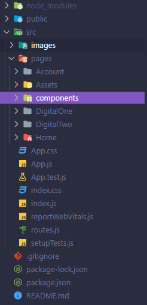
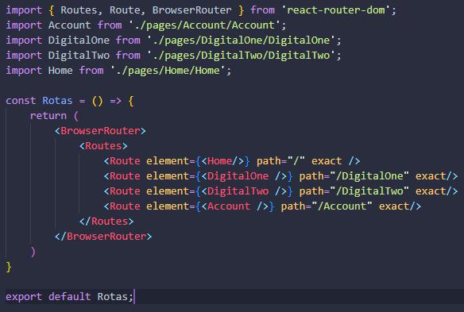

# Digital Republic Teste

<section>
  <h2>Contextualização</h2>
    
 Resolução do desafio proposto pela empresa Digital Republic em desenvolver um projeto Full-Stack. 

    
 Este repositório se baseia no Front-End do desafio. 

    
 Ao acessar a página você verá duas propostas de versões , cada uma foi feita para um back-end feito também proposto pelo desafio, os links para os backends estarão no final deste README. 

</section>

<section>
   <h2>Tecnologias utilizadas</h2>
    <ul>
      <li>ReactJs > 14</li>
      <li>MaterialUI</li>
    </ul>
    
 Para rodar o código primeiramente é necessário utilizar o comando "npm i" para instalar as dependências e em seguida utilizar o comando "npm run start".

    
 OBS: NodeJS necessário ser maior que 14 

    
 Foi utilizado o Visual Studio Code para o desenvolvimento de todo o código. 

</section>

<section>
  <h3> Organização das pastas </h3>
  
  
 Como podemos ver na imagem acima , possuímos a pasta src e dentro dela temos a pasta "pages" onde ficam as páginas e os componentes, o arquivo app que é o ponto inicial da aplicaçãoe o arquivo de "routes.js" onde ficam todas as rotas da aplicação.

  
  <h2>Pasta componentes</h2>
  <section>
    
Nesta pasta se encontram os cmoponentes reutilizáveis, ou seja componentes que servem como alguma funcionalidade ou sessão de uma página, eles são:

    <ul>
      <li>Footer</li>
      <li>Header</li>
      <li>LoggedAccount</li>
      <li>Main</li>
      <li>Modal</li>
    </ul>
  </section>
  
  <h2>Pastas de páginas</h2>
  <section>
    
As pastas de páginas , são aquelas onde seus componentes montam uma página inteira, elas são:

    <ul>
      <li>Account</li>
      <li>DigitalOne</li>
      <li>DIgitalTwo</li>
      <li>Home</li>
    </ul>
  </section>
  
   <h2>Arquivo de rotas</h2>
   <section>
    
O arquivo de rotas serve para setarmos todas as rotas da nossa aplicação como mostrado na imagem abaixo: 

    
    
Foi utilizado o "react-router-dom" para a criação e funcionamento de todas as rotas.

  </section>
  
  <section>
    
Back-End primeira versão:   https://github.com/victormdsp/DigitalRepublic 

    
Back-End segunda versão:   https://github.com/victormdsp/DigitalRepublic2 

  </sectio>
